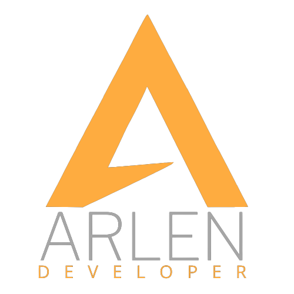

<!-- About the project -->

 
  

  &#xa0;

<h1 align="center">Wildbeast</h1>

  
  &nbsp
  
  &nbsp
  
  &nbsp
  
  &nbsp

  <a href="#dart-about">About</a> &#xa0; | &#xa0; 
  <a href="#rocket-technologies">Technologies</a> &#xa0; | &#xa0;
  <a href="#computer-installation">Installation</a> &#xa0; | &#xa0;
  <a href="#memo-license">License</a> &#xa0; | &#xa0;
  <a href="#v-credits">Credits</a> &#xa0; | &#xa0;
  <a href="#pencil2-author">Author</a>

 

## :dart: About ##

The Wildbeast project was developed during the Complete Web Design course at Origamid. During the course, we learned all the basics of UI/UX Design and coding. We are developed concepts such as semantic HTML, image optimization and CSS files.

## :rocket: Technologies ##

- HTML
- CSS

## :computer: Installation ##

Clone the repository  
git clone https://github.com/arlendev/wildbeast

## :memo: License ##

This project is under MIT license. See the [LICENSE](LICENSE) file for more details.

## :v: Credits ##

## :pencil2: Author ##

  

<a href="#top">Back to top</a>
